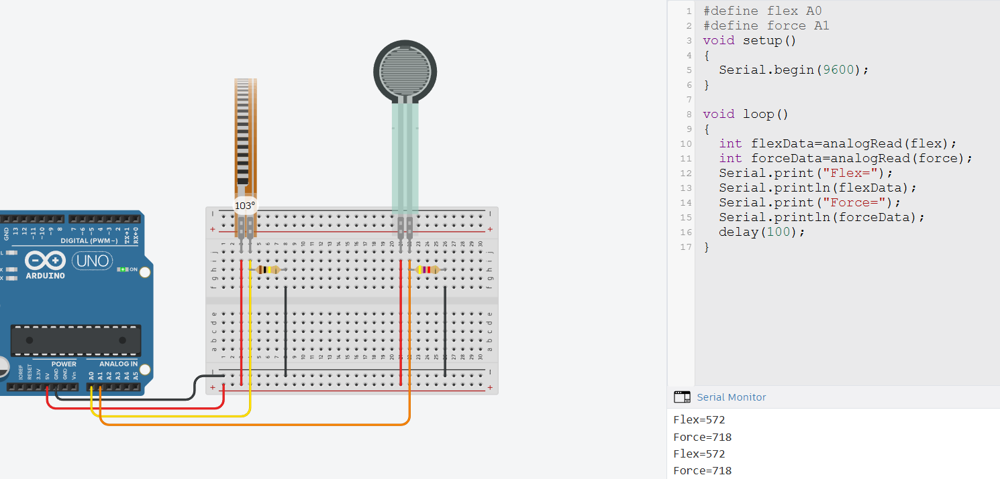

# FSR tüüpi andurid

FSR-tüüpi andurid, mida tuntakse ka jõu-anduritena, kasutavad mehaanilise mõju mõõtmiseks nende elektrilise takistuse muutumist. Suurema surve korral langeb anduri takistus, võimaldades seeläbi mõõta rakendatud jõudu. Takistitest rääkisime pikemalt [selles õppematerjalis](https://github.com/nullyks/Arduino-baaselemendid/blob/main/materjalid/1_takistid.md).

Andurite sisemuses on tavaliselt spetsiaalne polümeerkiht, millesse on lisatud juhtivaid osakesi. Rakendatud jõu mõjul tihenevad need osakesed, mille tulemusena paraneb anduri juhtivus ja langeb anduri elektriline takistus. See mõõdetud takistuse langus võimaldab elektroonikasüsteemidel tuvastada ja hinnata rakendatud jõu suurust.

Põhiline viis FSR-anduri kasutamiseks Arduinoga on luua voolujagur. Voolujaguri puhul ühendatakse FSR-andur koos kindla takistusega järjestikku ja lugeda analoogviiguga pinget nende kahe elemendi vahepunktist. Kui andurile rakendatakse jõudu või survet, muutub FSR-i takistus. See omakorda muudab ka voolujaguri väljundpinget Arduino analoogviigul.  
## FSR surveandur ja paindeandur

FSR surveandurid on tavaliselt õhukesed ja lamedad. Neid leidub erineva suuruse ja kujuga. Oma olemuselt on nad muuttakistid. Nagu ülal kirjas, muudab mehhaanilise jõu (surve) rakendamine andurile, selle juhtivuse väiksemaks. Voolujaguri moodustamiseks on tuleb see andur kombineerida sobiliku suurusega takistiga. Tavaliselt on heaks stardipositsiooniks 4.7   $k\Omega$ takisti.

FSR paindeandurid on tavaliselt erineva pikkusega lamedad ribad. Nende takistus muutub (väheneb) painutamisel. Tuleb tähele panna, et leidub paindesensoreid, mille takistus muutub ainult ühele poole painutades ja ka neid mille takistus muutub mõlemale poole painutades. Voolujaguri moodustamiseks tuleb ka see andur kombineerida püsitakistiga. Tavaliselt annab hea tulemust (võimalikult suure mõõtevahemiku) 50  $k\Omega$ takisti.

### FSR andurite Arduino UNO-ga liidestamise näide

[Interaktiivne simulatsioon](https://www.tinkercad.com/things/aLMZJny0Jl6-fsr?sharecode=-4llIroAReGc5yBg8hHEdGXIJQ0q4_8Rum3ZuQa14lw)

Näitekood:
~~~cpp
#define flex A0 //paindeandurit loeme viigu A0 kaudu
#define force A1 //Surveandurit loeme viigu A1 kaudu
void setup()
{
  Serial.begin(9600); //Alustame Serial ühenduse, et oleks kuhu andmeid saata
}

void loop()
{
  int flexData=analogRead(flex); //loeme paindeanduri näidu
  int forceData=analogRead(force); //loeme surveanduri näidu
  //Kirjutame andmed Serial ühenduse peale välja
  Serial.print("Flex=");
  Serial.println(flexData);
  Serial.print("Force=");
  Serial.println(forceData);
  delay(100); //ootame kümnendik sekundit
}
~~~