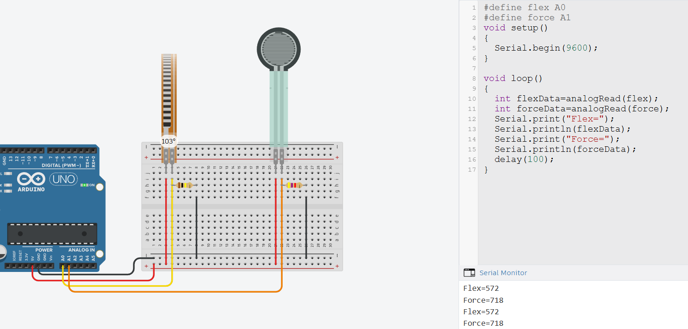

# FSR-jõuandur ja paindeandur

FSR-jõuandur ja paindeandur on mõlemad takistuspõhised andurid, kuid need mõõdavad erinevaid füüsikalisi suurusi. FSR-jõuandur reageerib survele või jõule, paindeandur aga painutamisele. Takistite tööpõhimõtet selgitab täpsemalt [Arduino baaselementide õppematerjal](https://github.com/nullyks/Arduino-baaselemendid/blob/main/materjalid/1_takistid.md).

## Andurite erinevus

| Omadus | FSR-jõuandur | Paindeandur |
|---|---|---|
| Mõõdetav mõju | anduri pinnale rakendatud jõud või surve | anduri painutamine |
| Takistuse muutumine | jõu suurenemisel takistus väheneb | painde suurenemisel takistus suureneb |
| Tüüpiline kuju | õhuke ümmarguse või kandilise tundliku alaga andur | pikk ja kitsas painduv riba |
| Tüüpiline kasutus | surve või puudutuse tuvastamine | painde või ligikaudse paindenurga hindamine |

FSR-jõuanduri takistus sõltub rakendatud jõust, kuid seos jõu ja takistuse vahel ei ole lineaarne. Andurite näidud võivad erineda ka sama mudeli eri eksemplaridel. Seetõttu sobib FSR-jõuandur ilma kalibreerimiseta eelkõige surve olemasolu ja suhtelise tugevuse hindamiseks.

Paindeanduri takistus suureneb, kui andurit lubatud suunas painutada. Andurit ei tohi järsult murda ega painutada vahetult ühendusklemmide juurest. Täpse paindenurga leidmiseks tuleb andur valitud paigaldusviisis kalibreerida.

## Pingejaguri kasutamine

Mõlemad andurid ühendatakse Arduino analoogsisendiga pingejaguri abil. Andur ja püsitakisti ühendatakse jadamisi ning Arduino mõõdab nende ühenduspunkti pinget.

Selles näites kasutatakse FSR-jõuanduriga 4,7 kΩ ja paindeanduriga 47 kΩ püsitakistit. Sobiv takistus sõltub kasutatavast andurist ja soovitud mõõtevahemikust.

Joonisel näidatud ühenduse korral suureneb FSR-jõuanduri näit surve kasvades, kuid paindeanduri näit väheneb painde kasvades. Kui anduri ja püsitakisti asukohad pingejaguris vahetada, muutub ka näidu muutumise suund.

## Andurite ühendamine Arduino UNO-ga

[Katseta ühendust Tinkercadi simulatsioonis](https://www.tinkercad.com/things/aLMZJny0Jl6-fsr?sharecode=-4llIroAReGc5yBg8hHEdGXIJQ0q4_8Rum3ZuQa14lw)

Tinkercadi näide ja ühendusjoonis kasutavad Arduino UNO R3 plaati. Samad viigud, ühenduspõhimõte ja programmikood sobivad ka Arduino UNO R4 WiFi plaadile.

Näitekood:

~~~cpp
const int PAINDE_ANDUR = A0;
const int FSR_ANDUR = A1;

void setup() {
  Serial.begin(9600);
}

void loop() {
  int paindeNait = analogRead(PAINDE_ANDUR);
  int jouNait = analogRead(FSR_ANDUR);

  Serial.print("Paindeandur: ");
  Serial.print(paindeNait);
  Serial.print(", FSR-jõuandur: ");
  Serial.println(jouNait);

  delay(100);
}
~~~

Joonisel näidatud ühenduse korral paindeanduri näit painutamisel väheneb ja FSR-jõuanduri näit surve suurendamisel kasvab. Täpne väärtus sõltub andurist, kasutatud püsitakistist ja anduri paigaldusest.

Kui näite põhjal on vaja arvutada paindenurka või jõudu, tuleb andur kõigepealt konkreetses paigalduses teadaolevate lähteväärtuste abil kalibreerida.

## Lisamaterjalid

[Interlink Electronicsi FSR 400 seeria kasutusjuhend](https://www.interlinkelectronics.com/downloads/integration-guides/fsr-400-series-integration-guide.pdf) – selgitab FSR-jõuanduri tööpõhimõtet, pingejagurit ja mõõtetulemuse sõltuvust rakendatud jõust.

[Spectra Symboli paindeanduri andmeleht](https://cdn.shopify.com/s/files/1/0578/4128/7283/files/Flex-Sensor-Datasheet-v2019a.pdf?v=1674511990) – kirjeldab paindeanduri takistuse muutumist, lubatud painutamist ja põhilisi ühendusviise.
