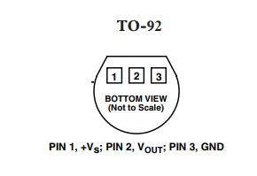
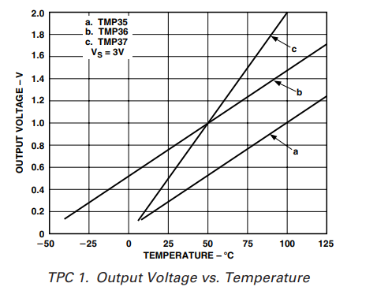
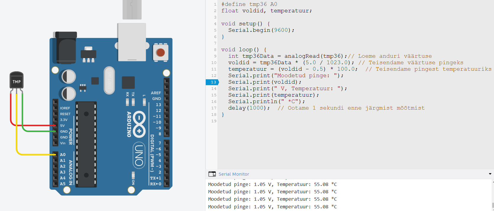

# TMP36 temperatuuriandur

TMP36 on analoogväljundiga pooljuht-temperatuuriandur. Anduri sees olev pooljuhtahel tekitab mõõdetud temperatuuriga võrdelise väljundpinge. TMP36 ei ole termopaar ega kasuta termoelektrilist elementi.

Anduri väljundpinge muutub temperatuuri muutumisel ligikaudu 10 mV iga Celsiuse kraadi kohta. Temperatuuril 0 °C on väljundpinge ligikaudu 500 mV ja temperatuuril 25 °C ligikaudu 750 mV. Seda 500 mV nihet kasutatakse selleks, et andur saaks ühe toiteallikaga mõõta ka nullist madalamaid temperatuure.

TMP36 töötab toitepingega 2,7–5,5 V ja selle määratud mõõtevahemik on −40…+125 °C. Tüüpiline mõõteviga on ligikaudu ±1 °C temperatuuril 25 °C ja ±2 °C kogu määratud mõõtevahemikus. Tegelik mõõteviga sõltub anduri variandist, toitepingest, ühendusest ja kasutustingimustest.

Selles õppematerjalis kasutatakse kolmes jalaga TO-92 korpuses TMP36 andurit. Selle viigud on toide (1), väljund (2) ja maandus (3).

**NB!** Andmelehel on TO-92 korpuse viigud näidatud altvaates. Enne anduri ühendamist kontrolli viikude järjekorda andmelehe ja konkreetse komponendi tähistuse järgi. Vale polaarsusega ühendamine võib andurit kahjustada.

*Allikas: [TMP35/TMP36/TMP37 andmeleht](https://www.arduino.cc/en/uploads/Main/TemperatureSensor.pdf)*

Järgmisel graafikul kirjeldab TMP36 väljundpinge ja temperatuuri suhet joon **b**. Tegemist on ligikaudu lineaarse suhtega.

*Allikas: [TMP35/TMP36/TMP37 andmeleht](https://www.arduino.cc/en/uploads/Main/TemperatureSensor.pdf)*

TMP36 mõõdab oma korpuse temperatuuri. Õhutemperatuuri mõõtmisel peab õhk pääsema anduri ümber liikuma. Eseme pinnatemperatuuri hindamiseks peab andur olema pinnaga heas soojuslikus kontaktis.

## TMP36 ühendamine Arduino UNO-ga ja temperatuuri arvutamine

Ühenda TMP36 toiteviik Arduino 5 V viiguga, maandusviik GND-ga ja väljundviik analoogsisendiga A0.

Nii Arduino UNO R3 kui ka UNO R4 WiFi tagastavad funktsiooniga `analogRead()` vaikimisi täisarvu vahemikus 0–1023. Näidu saab teisendada pingeks järgmise valemiga:

$$
pinge = analoogNäit \times \frac{5{,}0}{1023}
$$

Arvutus eeldab, et analoog-digitaalmuunduri tugipinge on täpselt 5,0 V. Tegelik toite- ja tugipinge võib sellest veidi erineda ning põhjustada mõõtetulemuses täiendava vea.

TMP36 väljundpinge on temperatuuril 0 °C ligikaudu 0,5 V ning muutub 0,01 V iga Celsiuse kraadi kohta. Temperatuuri saab arvutada järgmise valemiga:

$$
temperatuur = (pinge - 0{,}5) \times 100
$$

[Katseta ühendust Tinkercadi simulatsioonis](https://www.tinkercad.com/things/aYrG2vh1uUn-tmp36?sharecode=k2pp1kucaxTrZC0PG6rnkitRuZ47a5o3cB9-ljA1rHg)

Tinkercadi näide ja ühendusjoonis kasutavad Arduino UNO R3 plaati. Samad viigud, ühenduspõhimõte ja programmikood sobivad ka Arduino UNO R4 WiFi plaadile, kui kasutatakse vaikimisi 10-bitist analoog-digitaalmuunduri resolutsiooni.

Näitekood:

~~~cpp
const int TMP36_VIIK = A0;
const float TUGIPINGE = 5.0;
const float ADC_SUURIM_NAIT = 1023.0;

void setup() {
  Serial.begin(9600);
}

void loop() {
  int analoogNait = analogRead(TMP36_VIIK);
  float pinge = analoogNait * (TUGIPINGE / ADC_SUURIM_NAIT);
  float temperatuur = (pinge - 0.5) * 100.0;

  Serial.print("Mõõdetud pinge: ");
  Serial.print(pinge, 3);
  Serial.print(" V, temperatuur: ");
  Serial.print(temperatuur, 1);
  Serial.println(" °C");

  delay(1000);
}
~~~
