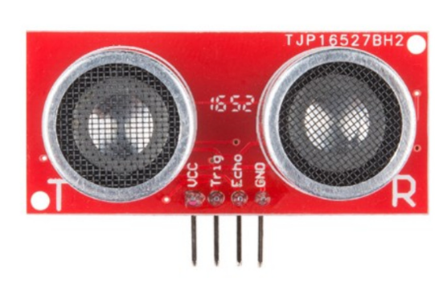
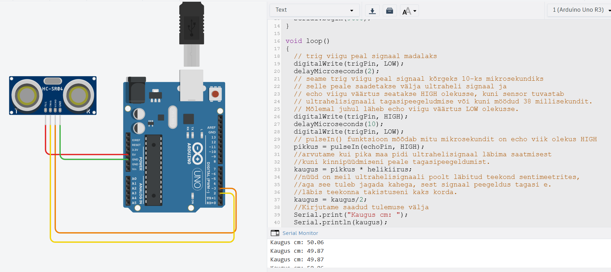

# HC-SR04 ultrahelipõhine kaugusandur

Anduri tööpõhimõte põhineb ultraheli levikul ja kajaefektil. HC-SR04 saadab lühikese kindla mustriga ultraheli impulsi (tavaliselt 40 kHz sagedusel), mis levib õhus ja tabab lähedal asuvat objekti. Kui impulss tabab objekti, peegeldub see tagasi anduri poole ning andur registreerib peegelduse.   

*Allikas: https://www.digikey.com/htmldatasheets/production/1979760/0/0/1/HC-SR04.pdf*

## HC-SR04 liidestamine Arduino UNO-ga ja näidu teisendamine sentimeetriteks

Anduril on neli viiku: VCC (1), Trig (2), Echo (3) ja GND (4).
VCC (1) ja GND (4) on vastavalt toite ning maanduse jaoks. Andur vajab 5V pingega toidet voolutugevusega 15 mA.

Trig (2) viigu kaudu käivitatakse kaugusmõõtmine, saates sinna 10uS pikkuse vooluimpulsi. Selleks sobib suvaline Arduino UNO digitaalviik.
Peale selle impulsi saamist saadab andur välja ultraheliimpulsi ja paneb 5V voolu Echo (3) viigule. Kui Andur registreeib saadetud ultraheliimpulsi tagasipeegeldumise, siis muutub pinge Echo (3) viigul 0-ks. Samuti juhtub see kui peegeldust ei registreerita 38 ms jooksul  - see tähendab, et anduri maksimaalses mõõtekauguses (400 cm) ei ole ühtegi takistust. 

Seega on võimalik mõõta 5V impulsi ajalist pikkust Echo (3) viigul ja teades heli levimise kiirust arvutada välja kui kaugel on takistus. Meeles tuleb pidada, et helilained läbivad peegeldudes kauguse kaks korda, seega tuleb tulemus jagada kahega.

[Interaktiivne simulatsioon](https://www.tinkercad.com/things/dtUHvXsMKNP-hc-sr04?sharecode=o7Vm0Tu1vb1w4WIx2713XlgD4eDhw3NN5Mk8uaHOkqo)

Koodinäide:
~~~cpp
#define trigPin 2
#define echoPin 3
#define helikiirus 0.0343 
//cm mikrosekundis

long pikkus;
float kaugus;

void setup()
{
  pinMode(trigPin, OUTPUT);
  pinMode(echoPin, INPUT);
  Serial.begin(9600);
}

void loop()
{
  // trig viigu peal signaal madalaks
  digitalWrite(trigPin, LOW);
  delayMicroseconds(2);
  // seame trig viigu peal signaal kõrgeks 10-ks mikrosekundiks
  // selle peale saadetakse välja ultraheli signaal ja
  // echo viigu väärtus seatakse HIGH olekusse, kuni sensor tuvastab
  // ultrahelisignaali tagasipeegeldumise või kuni möödud 38 millisekundit.
  // Mõlemal juhul läheb echo viigu väärtus LOW olekusse.
  digitalWrite(trigPin, HIGH);
  delayMicroseconds(10);
  digitalWrite(trigPin, LOW);
  // pulseIn() funktsioon mõõdab mitu mikrosekundit on echo viik olekus HIGH
  pikkus = pulseIn(echoPin, HIGH);
  //arvutame kui pika maa pidi ultrahelisignaal läbima saatmisest
  //kuni kinnipüüdmiseni peale tagasipeegeldumist. 
  kaugus = pikkus * helikiirus;
  //nüüd on meil ultrahelisignaali poolt läbitud teekond sentimeetrites, 
  //aga see tuleb jagada kahega, sest signaal peegeldus tagasi e.
  //läbis teekonna takistuseni kaks korda.
  kaugus = kaugus/2;
  //Kirjutame saadud tulemuse välja
  Serial.print("Kaugus cm: ");
  Serial.println(kaugus);
}
~~~

Ülaltoodud koodi katsetades võime märgata mõningaid ebatäpsusi mõõtetulemustes. Veidi parema tulemuse peaksime saama kui kasutame Tim Eckeli poolt loodud [NewPing teeki](https://bitbucket.org/teckel12/arduino-new-ping/wiki/Home).

Koodinäide:
~~~cpp
// Include NewPing Library
#include "NewPing.h"

// Hook up HC-SR04 with Trig to Arduino Pin 9, Echo to Arduino pin 10
#define TRIGGER_PIN 2
#define ECHO_PIN 3

// Maximum distance we want to ping for (in centimeters).
#define MAX_DISTANCE 400	

// NewPing setup of pins and maximum distance.
NewPing sonar(TRIGGER_PIN, ECHO_PIN, MAX_DISTANCE);

void setup() {
	Serial.begin(9600);
}

void loop() {
	Serial.print("Distance = ");
	Serial.print(sonar.ping_cm());
	Serial.println(" cm");
	delay(500);
}
~~~