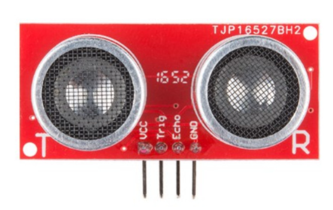
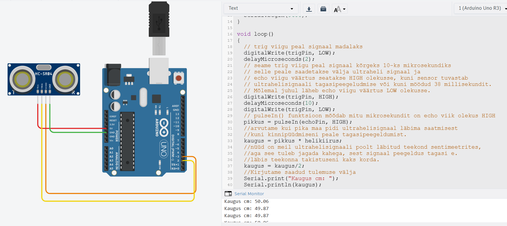

# HC-SR04 ultraheli-kaugusandur

HC-SR04 mõõdab kaugust ultraheli levimisaja põhjal. Mõõtmise alustamisel saadab andur välja kaheksast 40 kHz ultraheliperioodist koosneva signaali. Heli peegeldub takistuselt tagasi ning andur mõõdab signaali edasi-tagasi liikumiseks kulunud aega.

Anduri määratud mõõtevahemik on ligikaudu 2–400 cm. Tootja esitatud parim lahutusvõime on umbes 3 mm, kuid tegelik tulemus sõltub objekti suurusest, kujust, pinnast, nurgast ja keskkonnatingimustest.

*Allikas: [HC-SR04 andmeleht](https://cdn.sparkfun.com/datasheets/Sensors/Proximity/HCSR04.pdf)*

## HC-SR04 ühendamine Arduino UNO-ga

Anduril on neli viiku:

1. **VCC** – 5 V toide;
2. **Trig** – mõõtmise käivitamise sisend;
3. **Echo** – kaja levimisajale vastava impulsi väljund;
4. **GND** – maandus.

Anduri tüüpiline töövool on umbes 15 mA. Ühenda VCC Arduino 5 V viiguga ja GND Arduino GND-viiguga. Trig- ja Echo-viigud ühendatakse Arduino digitaalviikudega.

Mõõtmise käivitamiseks seatakse Trig-viik vähemalt 10 mikrosekundiks olekusse `HIGH`. Seejärel saadab andur ultrahelisignaali ja seab Echo-väljundi olekusse `HIGH`. Echo-väljund jääb kõrgesse olekusse ajaks, mis kulub ultrahelil objektini ja tagasi liikumiseks.

Echo-viigu impulsi kestuse põhjal saab kauguse arvutada valemiga:

$$
kaugus = \frac{impulsi\ kestus \times heli\ kiirus}{2}
$$

Toatemperatuuril võib heli kiiruseks kasutada ligikaudu 0,0343 cm/µs. Tulemus jagatakse kahega, sest mõõdetud aeg sisaldab nii teekonda andurist objektini kui ka tagasi.

Kui sobivat kaja ei leita, võib Echo-signaal kesta kümneid millisekundeid. Programm peab sellist olukorda eraldi käsitlema ega tohi puuduvat kaja tõlgendada nullsentimeetrise kaugusena.

**NB!** Pildi paremas servas on varasem programmiversioon. Kasuta pilti ühenduse koostamiseks ja programmi jaoks allpool olevat ajakohastatud koodinäidet, milles on arvestatud ka puuduva kajaga.

[Katseta ühendust Tinkercadi simulatsioonis](https://www.tinkercad.com/things/dtUHvXsMKNP-hc-sr04?sharecode=o7Vm0Tu1vb1w4WIx2713XlgD4eDhw3NN5Mk8uaHOkqo)

Tinkercadi näide ja ühendusjoonis kasutavad Arduino UNO R3 plaati. Samad viigud, ühenduspõhimõte ja programmikood sobivad ka Arduino UNO R4 WiFi plaadile.

Koodinäide:
~~~cpp
const int TRIG_VIIK = 2;
const int ECHO_VIIK = 3;
const float HELI_KIIRUS = 0.0343;          // cm/µs
const unsigned long KAJA_AJALIMIIT = 30000; // µs

void setup() {
  pinMode(TRIG_VIIK, OUTPUT);
  pinMode(ECHO_VIIK, INPUT);
  digitalWrite(TRIG_VIIK, LOW);
  Serial.begin(9600);
}

void loop() {
  // Käivitame mõõtmise vähemalt 10 µs pikkuse impulsiga.
  digitalWrite(TRIG_VIIK, LOW);
  delayMicroseconds(2);
  digitalWrite(TRIG_VIIK, HIGH);
  delayMicroseconds(10);
  digitalWrite(TRIG_VIIK, LOW);

  // Mõõdame Echo-signaali kestust, kuid ootame kõige rohkem 30 ms.
  unsigned long impulsiKestus =
      pulseIn(ECHO_VIIK, HIGH, KAJA_AJALIMIIT);

  if (impulsiKestus == 0) {
    Serial.println("Sobivat kaja ei tuvastatud.");
  } else {
    float kaugus = impulsiKestus * HELI_KIIRUS / 2.0;

    Serial.print("Kaugus: ");
    Serial.print(kaugus, 1);
    Serial.println(" cm");
  }

  // Andmeleht soovitab mõõtmiste vahele vähemalt 60 ms.
  delay(60);
}
~~~

## Lisamaterjalid

Selles peatükis kasutatud näitekood ei vaja eraldi teeki ning töötab nii Arduino UNO R3 kui ka UNO R4 WiFi plaadil.

Kui soovid ultrahelianduri juhtimise oma programmis teegi abil lihtsamaks muuta, saad Arduino IDE Library Managerist paigaldada teegi **Ultrasonic by Erick Simões**. Teek toetab HC-SR04 andurit ja võimaldab määrata puuduva kaja jaoks ajalimiidi.

[Ultrasonic teek ja kasutusnäited](https://github.com/ErickSimoes/Ultrasonic)
