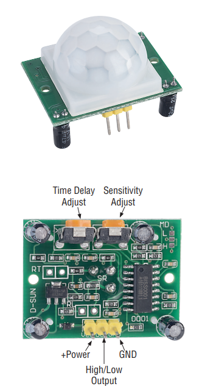
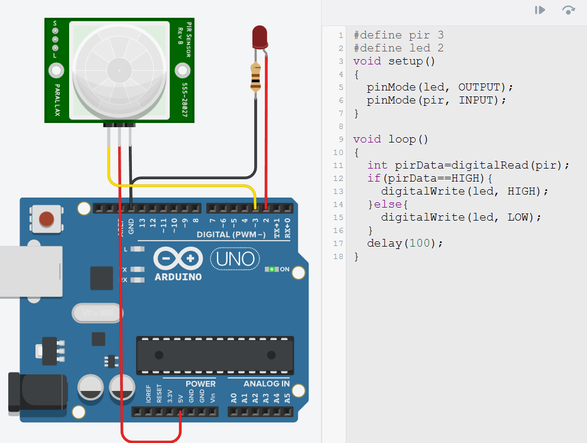

# PIR andurid

PIR andur e. passiivne infrapuna andur *(ingl Passive Infrared sensor)* on sensor, mida kasutatakse liikumise tuvastamiseks, mõõtes infrapuna kiirguse muutusi ümbritsevas keskkonnas. See töötab nii, et seade ei saada ise välja mingeid signaale, vaid ainult registreerib olemasolevat infrapuna kiirgust, mida kiirgavad kõik soojad objektid, näiteks inimesed ja loomad.

Anduri tööpõhimõte põhineb infrapuna energia muutumise tuvastamisel. Lihtsamad PIR andurid reageerivad mõõdetava infrapuna taseme muutumisele teatud ajaperioodi jooksul ning kui see ületab etteantud piiri, siis saadavad väljundviigule signaali, mis tähistab liikumist. Keerukamatel PIR anduritel võib olla mitu infrapuna detektorit, mis asetsevad erineva nurga all, kuid omavad kattuvat vaatevälja ja mis võrdlevad mõõdetava infrapunakiirguse taset - see võimaldab vähendada valepositiivseid tulemusi.

Pildil on lihtne PIR andur mudel: HC-SR501

*Allikas: https://static.rapidonline.com/pdf/74-1108_v2.pdf*

## HC-SR501 liidestamine Arduino UNO-ga

Anduril on väliste kontrolleritega liidestamiseks kolm viiku: toide (1), signaal (2) ja maandus (3). Toide (1) ühendatakse Arduino 5V viiguga ja maandus (3) Arduino GND viiguga. Signaal (2) edastab sensori infot andes pinge 3.3 V (liikumine) või 0 V (liikumist pole). Signaal viiku saab lugeda Arduino Uno digitaalse viigu abil. 

Sensoril endal on ka kaks potentsiomeetrit, millest esimene muudab sensori tundlikust - sisuliselt kui kaugelt sensor liikumist mõõdab (3m - 7m) ja teine signaalipikkust - kui kaua on liigumise tuvastamise puhul signaalviigul pinge 3.3V (5 - 300 sekundit).

Lisaks on anduril veel töörežiimi viigud L ja H, mille lühistamisel maandusega saab valida korduvsignaali (H) ja mitte-korduvsignaali (L) vahel. Korduvsignaali puhul pannakse liikumise tuvastamisel signaalviigule pinge 3.3V ja see püsib seal signaalipikkuse lõpuni, misjärel pinge muutub 0V peale. Kui liikumine jätkub, siis siis kogu tsükkel kordub. Mitte-korduvsignaali puhul jääb 3.3V pinge signaalviigule kuni liikumise lõpuni pluss signaalipikkusega määratud aeg.

**NB!** simulatsioonikeskkonnas on PIR anduri viikudel teistsugune järjekord.

[Interaktiivne simulatsioon](https://www.tinkercad.com/things/b2YLlguiArg-pir?sharecode=IIPz14-d-o6l_lRT_WNYv8WO_wRXWH9aG-wpDeXfDD0)

Koodinäide:
~~~cpp
#define pir 3 //selle viigu kaudu loeme PIR-i näitu
#define led 2 //selle viigu abil juhime LED-i
void setup()
{
  pinMode(led, OUTPUT);
  pinMode(pir, INPUT);
}

void loop()
{
  int pirData=digitalRead(pir); //loeme PIR näidu
  if(pirData==HIGH){ //kui on liikumine
  	digitalWrite(led, HIGH); //LED põlema
  }else{ //kui ei ole liikumist
  	digitalWrite(led, LOW);//LED kustu
  }
  delay(100);
}
~~~