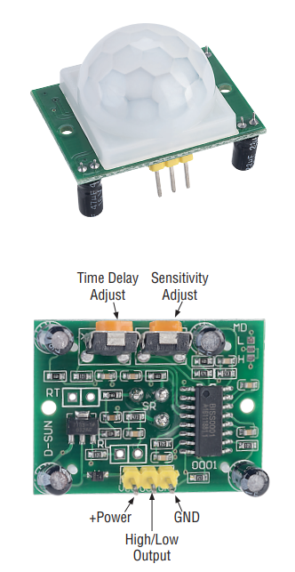
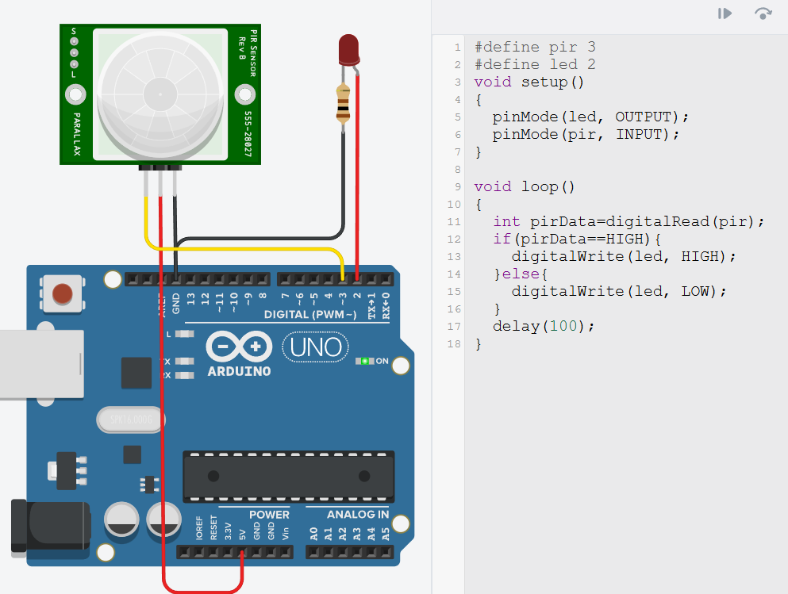

# HC-SR501 PIR-liikumisandur

PIR-andur ehk passiivne infrapunaandur (ingl *passive infrared sensor*) tuvastab oma vaateväljas infrapunakiirguse jaotuse muutusi. Andur on passiivne, sest see ei kiirga ise mõõtesignaali välja.

Inimesed, loomad ja teised ümbritsevast keskkonnast erineva temperatuuriga objektid kiirgavad infrapunakiirgust. Kui selline objekt liigub läbi PIR-anduri vaatevälja, muutub andurile langeva infrapunakiirguse jaotus ning moodul väljastab liikumist tähistava digitaalsignaali.

PIR-andur ei mõõda objekti kaugust ega tuvasta usaldusväärselt täiesti liikumatut objekti. Tuvastamist mõjutavad objekti ja tausta temperatuuride erinevus, liikumise suund ja kiirus ning anduri paigutus.

*Allikas: [HC-SR501 andmeleht](https://static.rapidonline.com/pdf/74-1108_v2.pdf)*

## HC-SR501 ühendamine Arduino UNO-ga

Moodulil on kolm ühendusviiku:

1. **VCC** – toide;
2. **OUT** – digitaalne väljundsignaal;
3. **GND** – maandus.

Ühenda VCC Arduino 5 V viiguga ja GND Arduino GND-viiguga. OUT-väljund on liikumise tuvastamisel ligikaudu 3,3 V ehk `HIGH` ning muul ajal 0 V ehk `LOW`. Seda signaali saab lugeda Arduino digitaalviiguga.

**NB!** HC-SR501 moodulite viikude järjestus võib tootjast ja mudeliversioonist sõltuda. Enne ühendamist kontrolli alati moodulile trükitud tähiseid.

Moodulil on tavaliselt kaks potentsiomeetrit. Ühega reguleeritakse tundlikkust ehk ligikaudset tuvastuskaugust ja teisega aega, mille jooksul väljund pärast liikumise tuvastamist olekus `HIGH` püsib. Tüüpiline reguleerimisvahemik on ligikaudu 3–7 m ja 5–300 sekundit.

## Töörežiimid

Jumperiga saab valida kahe töörežiimi vahel:

* **L – mittekorduv režiim:** liikumise tuvastamisel läheb väljund määratud ajaks olekusse `HIGH`. Selle aja jooksul tuvastatud uus liikumine aktiivset aega ei pikenda.
* **H – korduv režiim:** kui aktiivse aja jooksul tuvastatakse uus liikumine, alustatakse viiteaja arvestamist uuesti. Väljund võib seetõttu püsida olekus `HIGH` kogu liikumise vältel ja lülituda olekusse `LOW` alles pärast viimase liikumise järel möödunud viiteaega.

Pärast väljundi naasmist olekusse `LOW` võib moodulil olla lühike blokeerimisaeg, mille jooksul uut liikumist ei tuvastata.

Pärast toite ühendamist vajab PIR-andur keskkonnaga kohanemiseks tavaliselt mõnikümmend sekundit. Selle aja jooksul võib väljund ilma tegeliku liikumiseta olekute `HIGH` ja `LOW` vahel muutuda.

**NB!** Tinkercadi simulatsioonis kasutatava PIR-anduri viikude järjestus erineb joonisel oleva HC-SR501 mooduli viikude järjestusest.

[Katseta ühendust Tinkercadi simulatsioonis](https://www.tinkercad.com/things/b2YLlguiArg-pir?sharecode=IIPz14-d-o6l_lRT_WNYv8WO_wRXWH9aG-wpDeXfDD0)

Tinkercadi näide ja ühendusjoonis kasutavad Arduino UNO R3 plaati. Samad viigud, ühenduspõhimõte ja programmikood sobivad ka Arduino UNO R4 WiFi plaadile.

Tinkercadi ühendusjoonisel kasutatakse LED-iga 220 Ω takistit. Füüsilise Arduino UNO R3 või UNO R4 WiFi ühenduse korral kasuta 470 Ω takistit, mis hoiab LED-i voolu mõlema plaadi jaoks sobivas vahemikus.

Koodinäide:

~~~cpp
const int PIR_VIIK = 3;
const int LED_VIIK = 2;

void setup() {
  pinMode(PIR_VIIK, INPUT);
  pinMode(LED_VIIK, OUTPUT);
}

void loop() {
  int liikumine = digitalRead(PIR_VIIK);

  if (liikumine == HIGH) {
    digitalWrite(LED_VIIK, HIGH);
  } else {
    digitalWrite(LED_VIIK, LOW);
  }

  delay(100);
}
~~~
