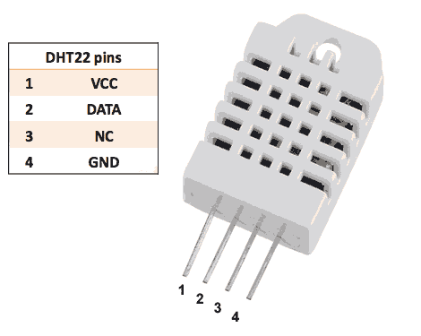
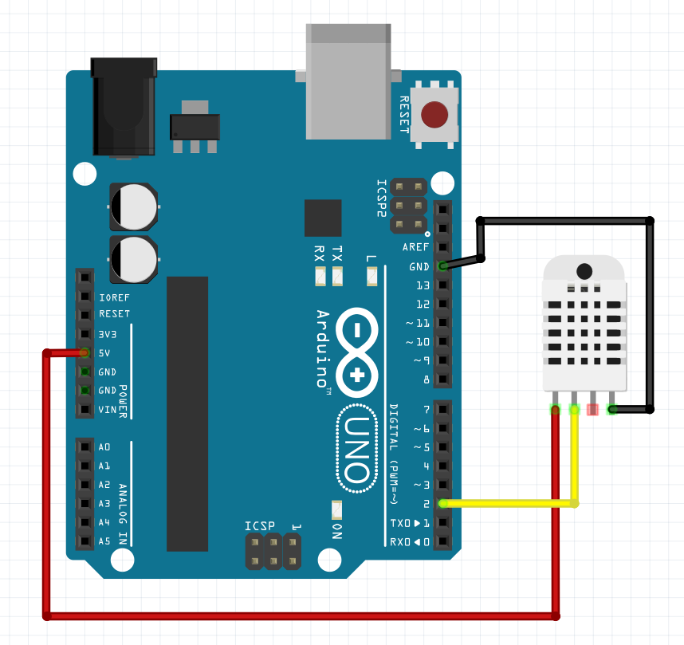

# DHT22 andur

DHT22 on digitaalne õhuniiskuse- ja temperatuuriandur. Anduri temperatuuri mõõtepiirkonnaks on -40 °C kuni +80 °C ning suhtelise õhuniiskuse mõõtmine katab vahemikku 0% kuni 100%. Mõõdetud väärtused edastatakse digitaalses vormis, mis lihtsustab andmete töötlemist mikrokontrollerite ja teiste seadmetega.

DHT22 tööpõhimõte põhineb kahe erineva anduri integratsioonil. Temperatuuri mõõtmiseks kasutatakse termistorit, mille elektritakistus muutub vastavalt temperatuurile, samas kui niiskuse määramiseks kasutatakse kapatsitiivset (mahutundlikku) andurit, kus niiskuse mõjul muutub dielektrilise materjali isolatsioonivõime. Mõlemad mõõtmised teisendatakse digitaalsignaalideks, mida edastatakse andmeside viigu kaudu kasutades tootjapoolset andmesideprotokolli.

*Allikas: https://www.electroschematics.com/am2302-dht22-datasheet/*

## DHT22 liidestamine Arduino UNO-ga

Anduril on neli viiku, millest tegelikult kasutatakse ainult kolme: VCC e. toide (1), andmeviik (2), NC e. ühendamata viik (3) ja GND e. maandusviik (4). Toide (1) ja maandus (4) ühendatakse Arduino UNO vastavate viikudega 5V ja GND. Andmeviiku (2) saab lugeda Arduino UNO digitaalviigu abil.

DHT22 andmesideprotokolli implementeerimiseks on mõistlik kasutada mõnd juba olemasolevat teeki, mis lihtsustab oluliselt anduri lugemist. Järgnevas näites kasutatakse [SimpleDHT](https://github.com/winlinvip/SimpleDHT) teeki.

Koodinäide:

~~~cpp
#include <SimpleDHT.h>
#define pinDHT22 2
SimpleDHT22 dht22(pinDHT22); //defineerime sensoriobjekti

void setup() {
  Serial.begin(9600);
}

void loop() {
  float temperatuur = 0;
  float niiskus = 0;
  int err = SimpleDHTErrSuccess; //veakood, mis tähistab vea puudumist
  //funktsiooniga read2() loeme sensoriobjekti poolt tagastatavad andmed muutujate
  //temperatuur ja niiskus aadressidele. Kui see funktsioon tagastab midagi muud peale 
  //ülaltoodud positiivse veakoodi, siis tegevus ebaõnnestus. Taavitame sellest
  //kasutajat, ootame 2 sekundit ja proovime uuesti.
  if ((err = dht22.read2(&temperatuur, &niiskus, NULL)) != SimpleDHTErrSuccess) {
    Serial.print("DHT22 lugemine ebaõnnestus, err="); 
    Serial.print(SimpleDHTErrCode(err));
    Serial.print(","); Serial.println(SimpleDHTErrDuration(err)); 
    delay(2000);
    return;
  }
  
  //kui saime andmed kätte siis, kirjutame need välja
  Serial.print("Lugemine õnnestus: ");
  Serial.print((float)temperatuur); 
  Serial.print(" *C, ");
  Serial.print((float)niiskus); 
  Serial.println(" %");
  
  // ootame kaks ja pool sekundit, sest DHT22 uuendab oma andmeid iga 2 sekundi tagant
  delay(2500);
}

~~~