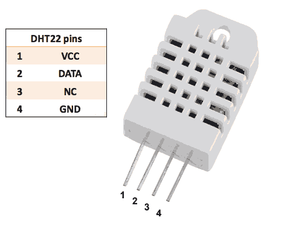
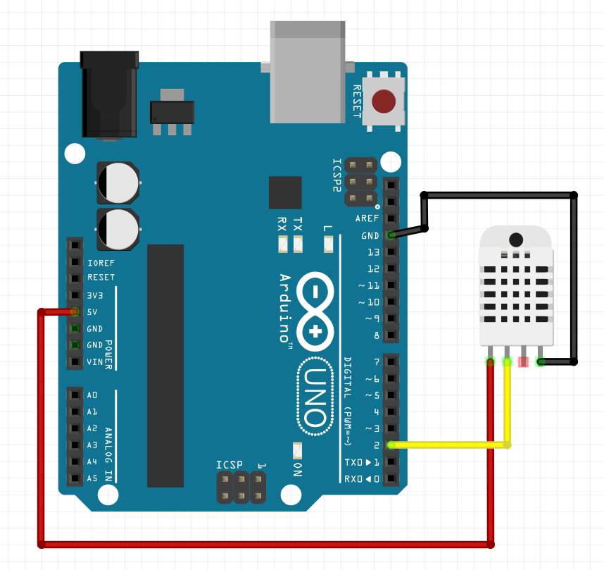

# DHT22 temperatuuri- ja õhuniiskusandur

DHT22 on digitaalne andur, mis mõõdab õhutemperatuuri ja suhtelist õhuniiskust. Temperatuuri mõõtevahemik on −40…+80 °C ja tüüpiline mõõtetäpsus ±0,5 °C. Suhtelise õhuniiskuse mõõtevahemik on 0–100% ning tüüpiline mõõtetäpsus ±2% RH, halvimal juhul kuni ±5% RH.

Anduris on temperatuuri mõõtmiseks termistor ja õhuniiskuse mõõtmiseks mahutavuspõhine niiskusandur. Sisseehitatud elektroonika töötleb mõõtetulemusi ja edastab need ühe andmeviigu kaudu digitaalsel kujul.

DHT22 on suhteliselt aeglane andur. Uut näitu ei tohiks küsida sagedamini kui ligikaudu iga kahe sekundi järel.

*Allikas: [AM2302/DHT22 tehniline juhend](https://www.aosong.com/uploadfiles/2025/04/20250417105409216.pdf)*

## Paljas andur ja andurimoodul

DHT22 võib olla paljas neljaviiguline andur või elektroonikaplaadile paigaldatud kolmeviiguline andurimoodul.

Palja anduri viigud eestvaates on:

1. **VCC** – toide;
2. **DATA** – andmesignaal;
3. **NC** – ühendamata viik;
4. **GND** – maandus.

Palja anduri DATA-viigu ja VCC-viigu vahele tuleb ühendada ligikaudu 10 kΩ tõmbetakisti. Valmis andurimoodulil on see takisti tavaliselt juba elektroonikaplaadil olemas.

**NB!** Moodulite ühendusviikude järjestus võib erineda. Enne ühendamist kontrolli alati moodulile trükitud tähiseid.

## DHT22 ühendamine Arduino UNO-ga

Ühenda VCC Arduino 5 V viiguga, GND Arduino GND-viiguga ja DATA Arduino digitaalviiguga 2. Palja DHT22 korral ühenda DATA- ja VCC-viigu vahele ka 10 kΩ takisti.

**NB!** Olemasoleval ühendusjoonisel ei ole 10 kΩ tõmbetakistit näidatud. Palja neljaviigulise anduri füüsilises ühenduses tuleb see kindlasti lisada. Kolmeviigulise DHT22 mooduli korral kontrolli, kas tõmbetakisti on moodulile juba paigaldatud.

Ühendusjoonis kasutab Arduino UNO R3 plaati. Sama ühenduspõhimõte sobib ka Arduino UNO R4 WiFi plaadile.

## Teegi paigaldamine

DHT22 andmeside ajastuse käsitsi programmeerimise asemel kasutame valmis teeki.

1. Ava Arduino IDE-s **Library Manager**.
2. Otsi teeki **DHT sensor library**.
3. Paigalda **DHT sensor library by Adafruit**.
4. Kui Arduino IDE pakub sõltuvuste paigaldamist, paigalda ka **Adafruit Unified Sensor**.

[Adafruiti DHT teek ja kasutusnäited](https://github.com/adafruit/DHT-sensor-library)

## Temperatuuri ja õhuniiskuse lugemine

Näitekood:

~~~cpp
#include <DHT.h>

const int DHT_VIIK = 2;
const int DHT_TUUP = DHT22;

DHT dht(DHT_VIIK, DHT_TUUP);

void setup() {
  Serial.begin(9600);
  dht.begin();
}

void loop() {
  // DHT22 vajab mõõtmiste vahel vähemalt ligikaudu kaks sekundit.
  delay(2000);

  float temperatuur = dht.readTemperature();
  float ohuniiskus = dht.readHumidity();

  if (isnan(temperatuur) || isnan(ohuniiskus)) {
    Serial.println("DHT22 lugemine ebaõnnestus.");
    return;
  }

  Serial.print("Temperatuur: ");
  Serial.print(temperatuur, 1);
  Serial.print(" °C, suhteline õhuniiskus: ");
  Serial.print(ohuniiskus, 1);
  Serial.println(" %");
}
~~~

Funktsioon `dht.readTemperature()` tagastab temperatuuri Celsiuse kraadides ja `dht.readHumidity()` suhtelise õhuniiskuse protsentides.

Kui andurilt lugemine ebaõnnestub, tagastab teek väärtuse `NaN` (ingl *not a number*). Funktsiooniga `isnan()` kontrollitakse, kas temperatuuri või õhuniiskuse näit puudub.
