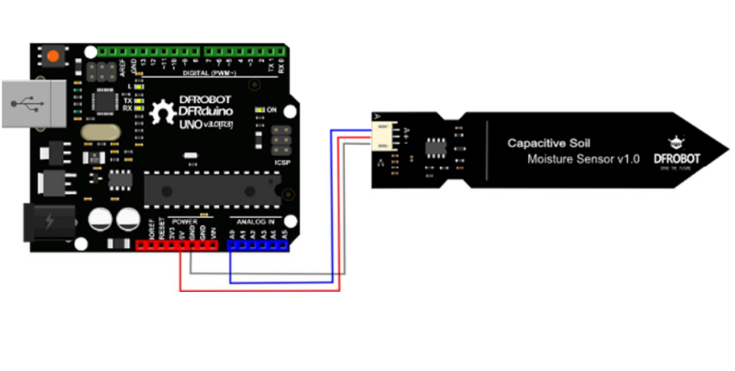
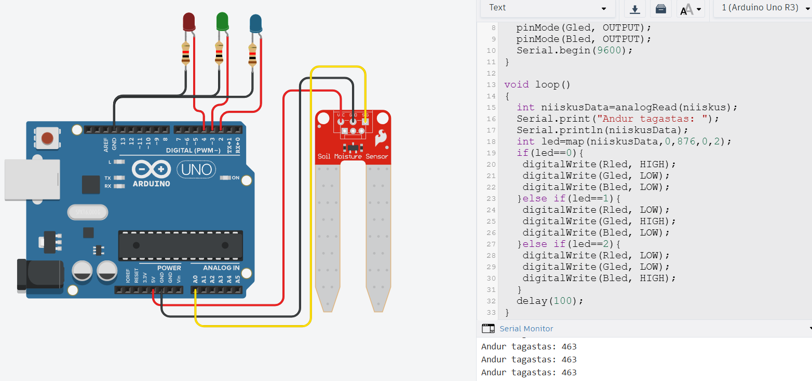

# Mullaniiskuse andurid

Levinud mullaniiskuse andurid töötavad kahel erineval põhimõttel - mõõdetakse, mulla elektrilist takistust kahe kontaktpunkti vahel (takistuspõhine mullaniiskusandur) või moodustatakse kahe elektroodi abil [kondensaator](https://github.com/nullyks/Arduino-baaselemendid/blob/main/materjalid/4_kondensaatorid.md), kus muld toimib dielektrikuna (mahutavuspõhine mullaniiskusandur). Takistuspõhise mullaniiskusanduri puhul on takistus seda väiksem, mida niiskem on muld. Mahutavuspõhise mullaniiskusanduri puhul mõõdetakse aega, mis kulub kindla pinge juures kondensaatori laadimiseks, kuna dielektrikuna selles kondensaatoris toimib muld ja märjema mulla dielektriline konstant on suurem, siis mida märjem on muld, seda kiiremine kondensaator täis laaditakse.

Ülaltoodust järeldub, et mõlema anduri puhul ei saa me tegelikult täpselt teada mulla suhtelist niiskust, vaid ainult niiskuse muutumist võrreldes mingi kindla algväärtusega. Seega tuleb oma rakenduses see algväärtus kalibreerida.

## Mahutavuspõhise mullaniiskussensori liidestamine Arduino UNO-ga

*Allikas: https://media.digikey.com/pdf/data%20sheets/dfrobot%20pdfs/sen0193_web.pdf*

Sensoril on kolm viiku: signaal (1), toide (2), maandus (3). Toide (2) ja maandus (3) ühendatakse vastavalt Arduino UNO 5V ja GND viikudega. Signaali (1) loetakse analoogviigu abil.

Näitekood:
~~~cpp
//sensori tagastatav väärtus kuivana õhu käes
#define kuivData 520 
//sensori tagastatav väärtus kui see on kastetud vette
#define veesData 260 
int vahemikud = (kuivData - veesData)/3; 
int mullaNiiskus = 0;

void setup() {
 Serial.begin(9600); 
}

void loop() {
mullaNiiskus = analogRead(A0); //eeldame, et sensori signaalviik on ühendatud A0-ga
if(mullaNiiskus > veesData && mullaNiiskus < (veesData + vahemikud)){
    Serial.println("Väga niiske");
}else if(mullaNiiskus > (veesData + vahemikud) && mullaNiiskus < (kuivData - vahemikud)){
    Serial.println("Niiske");
}else if(mullaNiiskus < kuivData && mullaNiiskus > (kuivData - vahemikud)){
    Serial.println("Kuiv");
}
delay(100);
} 
~~~

## Takistuspõhise mullaniiskussensori liidestamine Arduino UNO-ga

*Allikas: https://github.com/sparkfun/Soil_Moisture_Sensor*

Sensoril on kolm viiku: toide (1), maandus (2) ja signaal (3). Toide (1) ja maandus (2) ühendatakse vastavalt Arduino UNO 5V ja GND viikudega. Signaali (3) loetakse analoogviigu abil.

[Interaktiivne simulatsioon](https://www.tinkercad.com/things/4pnOvk3wPmM-mullaniiskusandur?sharecode=pWHr1Q7Gbze-wi4If8gJDYhszK5PpjZSsQYjYZZKnzA)

Näitekood:
~~~cpp
#define Rled 4
#define	Gled 3
#define	Bled 2
#define niiskus A0
void setup()
{
  pinMode(Rled, OUTPUT);
  pinMode(Gled, OUTPUT);
  pinMode(Bled, OUTPUT);
  Serial.begin(9600);
}

void loop()
{
  int niiskusData=analogRead(niiskus);
  Serial.print("Andur tagastas: ");
  Serial.println(niiskusData);
  int led=map(niiskusData,0,876,0,2);
  if(led==0){
   digitalWrite(Rled, HIGH);
   digitalWrite(Gled, LOW);
   digitalWrite(Bled, LOW); 
  }else if(led==1){
   digitalWrite(Rled, LOW);
   digitalWrite(Gled, HIGH);
   digitalWrite(Bled, LOW);
  }else if(led==2){
   digitalWrite(Rled, LOW);
   digitalWrite(Gled, LOW);
   digitalWrite(Bled, HIGH);
  }
  delay(100);
}
~~~