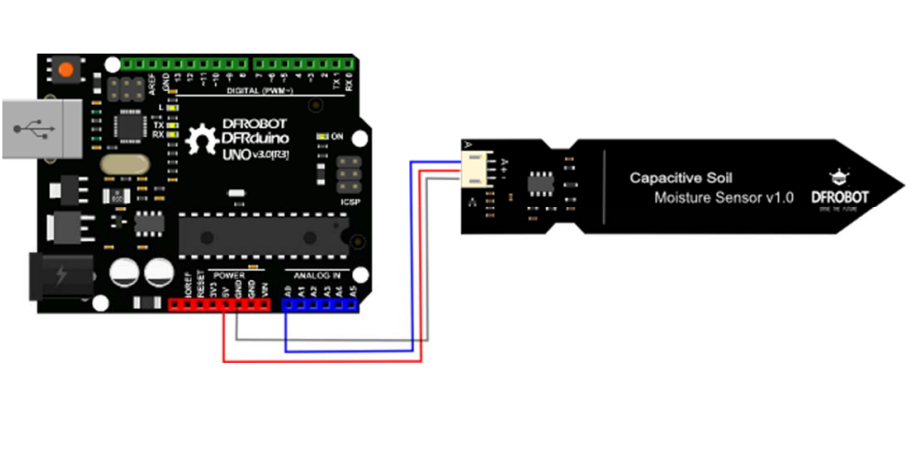
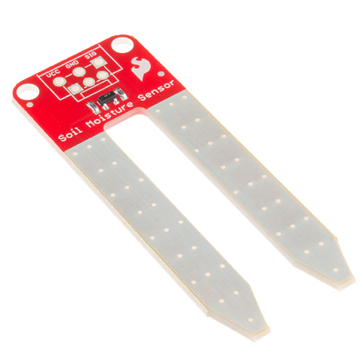
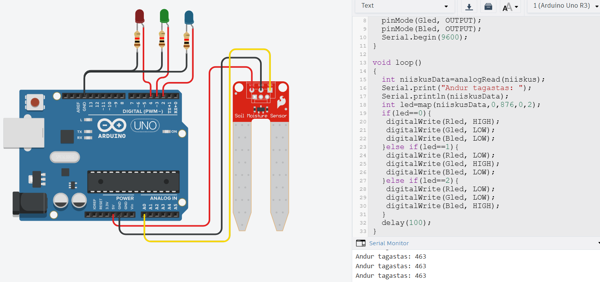

# Mullaniiskusandurid

Lihtsad mullaniiskusandurid ei mõõda tavaliselt mulla veesisaldust otse. Need mõõdavad mõnda niiskusega seotud elektrilist omadust ning annavad selle põhjal suhtelise näidu.

## Takistuspõhine ja mahutavuspõhine andur

Takistuspõhisel anduril on kaks mullaga kokkupuutuvat elektroodi. Niiskuse ja lahustunud soolade lisandumisel suureneb mulla elektrijuhtivus ning elektroodide vaheline takistus üldjuhul väheneb. Näitu mõjutavad lisaks veesisaldusele mulla koostis, soolsus, temperatuur ja elektroodide seisukord.

Takistuspõhise anduri metallist elektroodid korrodeeruvad alalisvoolu toimel. Anduri kasutusea pikendamiseks tuleks sellele anda toide ainult mõõtmise ajaks ning pikaajaliseks mõõtmiseks tuleks eelistada mahutavuspõhist andurit.

Mahutavuspõhise anduri elektroodid moodustavad [kondensaatori](https://github.com/nullyks/Arduino-baaselemendid/blob/main/materjalid/4_kondensaatorid.md). Mulla veesisalduse muutumine muudab elektroodide vahelise keskkonna dielektrilisi omadusi ja seega anduri mahtuvust. Anduri elektroonika teisendab selle muutuse analoogpingeks.

Mahutavuspõhise anduri väljundväärtuse suund sõltub andurimudelist. Mõnel anduril näit niiskuse suurenemisel väheneb ja mõnel suureneb. Seetõttu ei tohi programmis eeldada kindlat suunda ilma konkreetset andurit kontrollimata.

## Kalibreerimine

Mõlema anduritüübi näitu tuleb kasutatava anduri ja mulla jaoks kalibreerida.

1. Mõõda anduri näit kuivas võrdlusolukorras ja salvesta see kuiva näiduna.
2. Mõõda näit märjas võrdlusolukorras ja salvesta see märja näiduna.
3. Teisenda nende kahe väärtuse vahele jäävad näidud suhteliseks skaalaks, näiteks 0–100%.
4. Korda kalibreerimist, kui vahetad andurit, mulda või anduri paigaldusviisi.

Tootja näidiskalibreerimises kasutatakse kuiva väärtuse leidmiseks andurit õhus ja märja väärtuse leidmiseks anduri mõõteosa vees. Vette tohib asetada ainult anduri selleks mõeldud mõõteosa. Elektroonikakomponendid ja ühenduspistik peavad jääma kuivaks.

Selliselt saadud protsent on kalibreeritud suhteline näit, mitte laboratoorselt määratud mulla veesisaldus.

## Mahutavuspõhise mullaniiskusanduri ühendamine Arduino UNO-ga

*Allikas: [DFRoboti SEN0193 andmeleht](https://media.digikey.com/pdf/data%20sheets/dfrobot%20pdfs/sen0193_web.pdf)*

Anduril on kolm viiku: signaal, toide ja maandus. Ühenda toide Arduino 5 V viiguga, maandus GND-viiguga ning signaal analoogsisendiga A0.

Joonisel on Arduino UNO R3 plaat. Sama ühenduspõhimõte ja näitekood sobivad ka Arduino UNO R4 WiFi plaadile, kui kasutatakse vaikimisi 10-bitist analoog-digitaalmuunduri resolutsiooni.

Allolevad `KUIV_NAIT` ja `MARG_NAIT` on näidisväärtused. Asenda need oma anduri kalibreerimisel saadud väärtustega.

Näitekood:

~~~cpp
const int ANDURI_VIIK = A0;

// Asenda need oma anduri kalibreerimisel saadud väärtustega.
const int KUIV_NAIT = 520;
const int MARG_NAIT = 260;

void setup() {
  Serial.begin(9600);
}

void loop() {
  int toorNait = analogRead(ANDURI_VIIK);

  // Teisendame kalibreeritud vahemiku suhteliseks skaalaks 0–100%.
  int niiskusProtsent =
      map(toorNait, KUIV_NAIT, MARG_NAIT, 0, 100);

  // Piirame tulemuse juhuks, kui näit väljub kalibreeritud vahemikust.
  niiskusProtsent = constrain(niiskusProtsent, 0, 100);

  Serial.print("Anduri toornäit: ");
  Serial.print(toorNait);
  Serial.print(", suhteline niiskus: ");
  Serial.print(niiskusProtsent);
  Serial.println(" %");

  if (niiskusProtsent < 33) {
    Serial.println("Kuiv");
  } else if (niiskusProtsent < 67) {
    Serial.println("Niiske");
  } else {
    Serial.println("Väga niiske");
  }

  delay(500);
}
~~~

## Takistuspõhise mullaniiskusanduri ühendamine Arduino UNO-ga

*Allikas: [SparkFuni Soil Moisture Sensor](https://github.com/sparkfun/Soil_Moisture_Sensor)*

Moodulil on kolm viiku: toide, maandus ja analoogsignaal. Ühenda toide Arduino 5 V viiguga, maandus GND-viiguga ning signaal analoogsisendiga A0.

**NB!** Eri tootjate moodulitel võib viikude järjestus erineda. Enne ühendamist kontrolli moodulile trükitud tähiseid.

Takistuspõhise anduri elektroodid korrodeeruvad, kui need on pikalt niiskes mullas ja pidevalt pingestatud. Kasuta sellist andurit eelkõige lühiajalisteks katseteks ning eemalda pärast katset toide. Pikaajaliseks mõõtmiseks eelista mahutavuspõhist andurit.

[Katseta ühendust Tinkercadi simulatsioonis](https://www.tinkercad.com/things/4pnOvk3wPmM-mullaniiskusandur?sharecode=pWHr1Q7Gbze-wi4If8gJDYhszK5PpjZSsQYjYZZKnzA)

Tinkercadi ühendusjoonisel kasutatakse LED-idega 220 Ω takisteid. Füüsilise Arduino UNO R3 või UNO R4 WiFi ühenduse korral kasuta iga LED-iga 470 Ω takistit.

Allolevad kalibreerimisväärtused on näited. Asenda need oma anduri kuiva ja märja näiduga.

Näitekood:

~~~cpp
const int PUNANE_LED = 4;
const int ROHELINE_LED = 3;
const int SININE_LED = 2;
const int ANDURI_VIIK = A0;

// Asenda need oma anduri kalibreerimisel saadud väärtustega.
const int KUIV_NAIT = 876;
const int MARG_NAIT = 0;

void setup() {
  pinMode(PUNANE_LED, OUTPUT);
  pinMode(ROHELINE_LED, OUTPUT);
  pinMode(SININE_LED, OUTPUT);
  Serial.begin(9600);
}

void loop() {
  int toorNait = analogRead(ANDURI_VIIK);

  int niiskusProtsent =
      map(toorNait, KUIV_NAIT, MARG_NAIT, 0, 100);
  niiskusProtsent = constrain(niiskusProtsent, 0, 100);

  Serial.print("Anduri toornäit: ");
  Serial.print(toorNait);
  Serial.print(", suhteline niiskus: ");
  Serial.print(niiskusProtsent);
  Serial.println(" %");

  if (niiskusProtsent < 33) {
    // Kuiv: põleb punane LED.
    digitalWrite(PUNANE_LED, HIGH);
    digitalWrite(ROHELINE_LED, LOW);
    digitalWrite(SININE_LED, LOW);
  } else if (niiskusProtsent < 67) {
    // Paras niiskus: põleb roheline LED.
    digitalWrite(PUNANE_LED, LOW);
    digitalWrite(ROHELINE_LED, HIGH);
    digitalWrite(SININE_LED, LOW);
  } else {
    // Väga niiske: põleb sinine LED.
    digitalWrite(PUNANE_LED, LOW);
    digitalWrite(ROHELINE_LED, LOW);
    digitalWrite(SININE_LED, HIGH);
  }

  delay(500);
}
~~~
